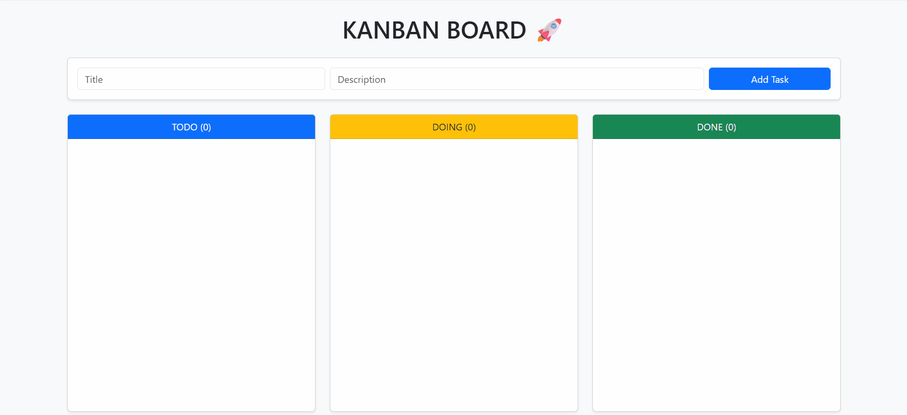

# Agile Task Manager

## Project Overview

This project is a Task Management Web Application developed using Agile methodology (Scrum).

The objective is to build a scalable and well-structured system that allows users to manage tasks through workflow displayed in a Kanban board.

The project follows a layered architecture and Git version control best practices.

---

## Objectives

- Apply Agile (Scrum) methodology
- Implement user stories through structured sprints
- Follow clean architecture principles
- Enforce business rules in a dedicated Service Layer
- Maintain proper documentation
- Use Git with strucutred commits and branches

---

## Technologies Used

- Python
- Flask
- SQLite
- SQLAlchemy
- HTML / CSS
- Bootsrap 5
- Pytest
- Git & Github

---

## Project Structure

- 'domain/' -> Business model (Task entity)
- 'infraestructure/' -> Database configuration & repositories
- 'services/' -> Business logic and workflow validation
- 'templates/' -> HTML views (Kanban board, edit form)
- 'static/' -> CSS files
- 'docs/' -> Agile documentation (Sprints, Backlog, DoD)

---

## Agile Development Process

This project was built incrementally across 3 structured sprints.

### 🟦 Sprint 1 - Core Architecture & CRUD

- Layered architecture implementation
- Task creation and editing
- Basic status updates 
- SQLite integration
- Foundation for future workflow control

---

### 🟦 Sprint 2 - Lifecycle Management & Testing

- Controlled workflow transitions (Jira-style logic)
- Allowed transitions:
    - todo -> doing
    - doing -> done
    - done -> doing
- Invalid transitions rejected
- Delete functionality implemented
- Automated unit tests with pytest
- In-memory SQLite database for isolated testing

Business rules are enforced exclusively in the Service Layer

---

### 🟦 Sprint 3 - Kanban Board & UX Improvements

- Professional Kanban board visualization
- Tasks grouped by state (todo, doing, done)
- Column task counters
- Conditional description rendering
- Delete option visible only in DONE column
- Confirmation dialog before deletion
- Bootstrap 5 integration for improved UI
- No modification to core business logic

---

### 🟦 Sprint 4 - Authentication & Drag-and-Drop Interaction

- Secure user registration and login (Flask-Login)
- Password hashing using Werkzeug
- Session-based authentication
- Multi-user task isolation
- Task ownership validation at Service Layer
- Drag-and-Drop task transitions (SortableJS)
- Controlled HTTP responses (204 / 404)
- Backend workflow validation preserved
- Additional automated tests for authentication and ownership

---

## Architecture

The system follows a clean layered architecture:

- **Flask** -> Controller Layer
- **TaskService & Authservice** -> Business Logic Layer
- **Respositories** -> Persistence Layer
- **Domain Models (Task + User)** -> Domain Layer

This ensures:

- Separation of concerns
- Single Responsability Principle
- Maintanable and scalable design
- Business rule protection

---

## Controlled workflow

The application enforces a strict task lifecycle:

- todo -> doing
- doing -> done
- done -> doing

Drag-and-drop interactions do not bypass backend workflow validation.

Invalid transitions are rejected at the Service level.

The UI never contains business logic.

--- 

## Running the Application

1. Create virtual environment:
    *'python -m venv venv'*

2. Activate it:
    *'venv\Scripts\activate'*

3. Install dependencies:
    *'pip install -r requirementes.txt'*

4. Run the app:
    *'python app.py'*

5. Open in browser:
    *'http:/localhost:5000'*

---

## Running Tests

**Pytest**

Test use an insolated in-memory SQLite database to prevent affecting production data.

---

## Engineering Principles Applied

- Clean architecture
- Separation of concerns
- Defensive Programming
- Incremental Agile Deliverey
- Automated Testing
- Controlled Workflow Validation

---

## Future Improvements

- Role-based access control (Admin / User)
- REST API endpoints
- Task priority levels
- Deployment configuration
- Docker containerization
- Pomodoro implementation
- Visuals updated to look like pokemon

--- 

## Application Demo

## Author

Developed by **Jose Ignacio Ramiro Castro**

Agile-based Software Development Project