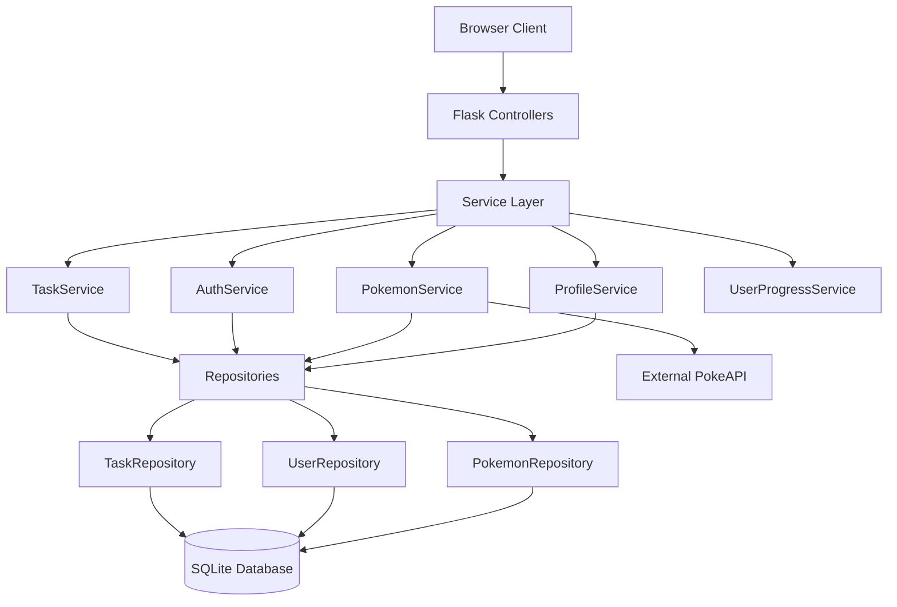

# Gamified Productivity System (Agile Scrum Project)

## Project Overview

This project is a gamified productivity system developed using Agile methodology (Scrum).

It combines task management, project organization, and RPG-style progression mechanics to create and engaging productivity experience.

Users can manage tasks through a Kanban board, organize them into projects, classify them by context, and earns rewards such as XP and Pokemon.

The system is designed with a clean layered architecture and follows best practices for scalability and maintainability.

---

## Objectives

- Apply Agile (Scrum) methodology
- Implement user stories through structured sprints
- Follow clean architecture principles
- Enforce business rules in a dedicated Service Layer
- Maintain proper documentation
- Use Git with structured commits and branches

---

## Key Features

- Kanban-based task management with controlled workflow
- Project-based task organization
- Context-aware task classification
- Project progress tracking
- Dedicated project views with scoped Kanban boards
- Drag & drop task interaction (SortableJS)
- XP and level progression system
- Pokemon reward system (PokeAPI integration)
- Pomodoro productivity timer
- Trainer profile with statistics and Pokedex
- Fully responsive UI (mobile, tablet, desktop)
- REST API for external integrations

---

## Technologies Used

- Python
- Flask
- SQLite
- SQLAlchemy
- HTML / CSS
- Bootstrap 5
- Pytest
- Git & Github

---

## Project Structure

- 'domain/' -> Business model (Task entity)
- 'infraestructure/' -> Database configuration & repositories
- 'services/' -> Business logic and workflow validation
- 'templates/' -> HTML views (Kanban board, edit form)
- 'static/' -> CSS files
- 'docs/' -> Agile documentation (Sprints, Backlog, DoD)

---

## Agile Development Process

This project was built incrementally across 8 structured sprints.

### 🟦 Sprint 1 - Core Architecture & CRUD

- Layered architecture implementation
- Task creation and editing
- Basic status updates 
- SQLite integration
- Foundation for future workflow control

---

### 🟦 Sprint 2 - Lifecycle Management & Testing

- Controlled workflow transitions (Jira-style logic)
- Allowed transitions:
    - todo -> doing
    - doing -> done
    - done -> doing
- Invalid transitions rejected
- Delete functionality implemented
- Automated unit tests with pytest
- In-memory SQLite database for isolated testing

Business rules are enforced exclusively in the Service Layer

---

### 🟦 Sprint 3 - Kanban Board & UX Improvements

- Professional Kanban board visualization
- Tasks grouped by state (todo, doing, done)
- Column task counters
- Conditional description rendering
- Delete option visible only in DONE column
- Confirmation dialog before deletion
- Bootstrap 5 integration for improved UI
- No modification to core business logic

---

### 🟦 Sprint 4 - Authentication & Drag-and-Drop Interaction

- Secure user registration and login (Flask-Login)
- Password hashing using Werkzeug
- Session-based authentication
- Multi-user task isolation
- Task ownership validation at Service Layer
- Drag-and-Drop task transitions (SortableJS)
- Controlled HTTP responses (204 / 404)
- Backend workflow validation preserved
- Additional automated tests for authentication and ownership

---

### 🟦 Sprint 5 - Gamification & Api Integration

- Hybrid task priority system (manual + automatic escalation)
- Rest API for task management
- External Pokedex API integration
- Mocked API calls during automated testing
- Expanded automated test coverage

---

### 🟦 Sprint 6 - Productivity Mechanics & Trainer Progression

- Pomodoro Focus timer implementation
- XP reward system for focus sessions
- Trainer level progression system
- XP progress bar visualization
- Trainer profile page with productivity statistics
- Personal Pokemon collection display

---

### 🟦 Sprint 7 - Pokedex System & Collection Improvements

- Full Pokedex visualization (1-151 Pokemon)
- Captured Pokemon appear with name, sprite, and rarity indicators
- Non-captured Pokemon appear as silhouettes
- Interactive Pokemon detail modal with:
    - Pokemon type
    - Height
    - Weight
    - Abilities
- Dynamic styling based on Pokemon types
- Highlight newly captured Pokemon
- Refactor of PokemonService to use PokemonRepository
- Improved architecture separation between service and persitance layers

---

### 🟦 Sprint 8 - Project System & Responsive UI

- Project-based task organization
- Context classification for tasks
- Advanced filtering system (project + context)
- Project progress tracking
- Dedicated UI across devices (mobile, tablet, desktop)
- UI/UX improvements for scabalitity and usability

## Architecture

The system follows a clean layered architecture:

- **Flask** -> Controller Layer
- **TaskService, AuthService, PokemonService & ProfileService** -> Business Logic Layer
- **Respositories** -> Persistence Layer
- **Domain Models (Task, User, Pokemon)** -> Domain Layer

This ensures:

- Separation of concerns
- Single Responsibility Principle
- Maintainable and scalable design
- Business rule protection

---

## System Architecture

```mermaid
flowchart TD

    A[Browser Client] --> B[Flask Controllers]

    B --> C[Service Layer]

    C --> D[TaskService]
    C --> E[AuthService]
    C --> F[PokemonService]
    C --> G[ProfileService]
    C --> H[UserProgressService]

    D --> I[Repositories]
    E --> I
    F --> I
    G --> I

    I --> J[TaskRepository]
    I --> K[UserRepository]
    I --> L[PokemonRepository]

    J --> M[(SQLite Database)]
    K --> M
    L --> M

    F --> N[External PokeAPI]

```
---

### Architecture Principles

This project follows a layered architecture designed to enforce separation of concerns and maintain clear boundaries between application layers.

- **Controller Layer** handles HTTP requests and responses
- **Service Layer** contains business logic and workflow rules
- **Repository Layer** manages persistence and database interaction
- **Domain Layer** defines core entities of the system

---

## Controlled workflow

The application enforces a strict task lifecycle:

- todo -> doing
- doing -> done
- done -> doing

Drag-and-drop interactions do not bypass backend workflow validation.

Invalid transitions are rejected at the Service level.

The UI never contains business logic.

--- 

## Running the Application

1. Create virtual environment:
    *'python -m venv venv'*

2. Activate it:
    *'venv\Scripts\activate'*

3. Install dependencies:
    *'pip install -r requirementes.txt'*

4. Run the app:
    *'python app.py'*

5. Open in browser:
    *'http:/localhost:5000'*

---

## Running Tests

**Pytest**

Test use an isolated in-memory SQLite database to prevent affecting production data.

---

## Engineering Principles Applied

- Clean architecture
- Separation of concerns
- Defensive Programming
- Incremental Agile Deliverey
- Automated Testing
- Controlled Workflow Validation

---

## Future Improvements

- Achievement / badge system
- Pokemon rarity and shiny mechanics
- Pokemon evolution system
- Docker containerization
- Deployment to cloud environment

--- 

## Disclaimer

This project is a non-commercial educational project created for learning purposes.

Pokémon and related trademarks belong to Nintendo, Game Freak, and The Pokémon Company.

All Pokémon data is retrieved from the public PokeAPI.

---

## Application Demo

## Author

Developed by **Jose Ignacio Ramiro Castro**

Agile-based Software Development Project